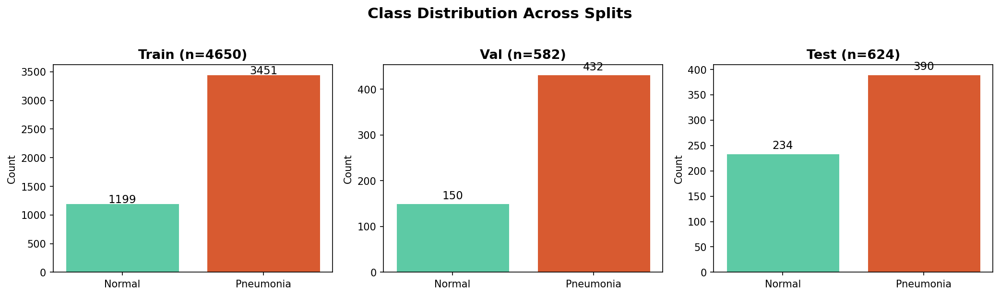
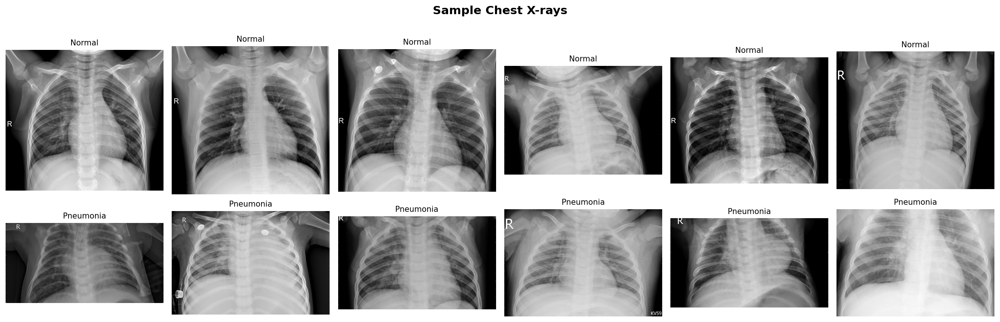
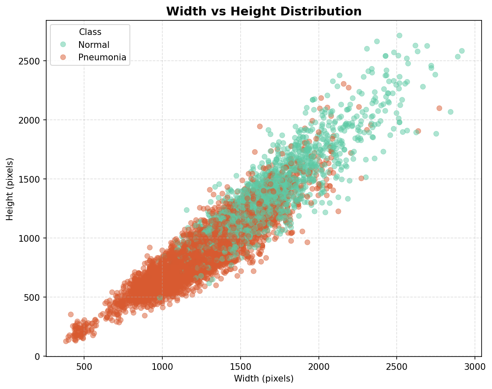
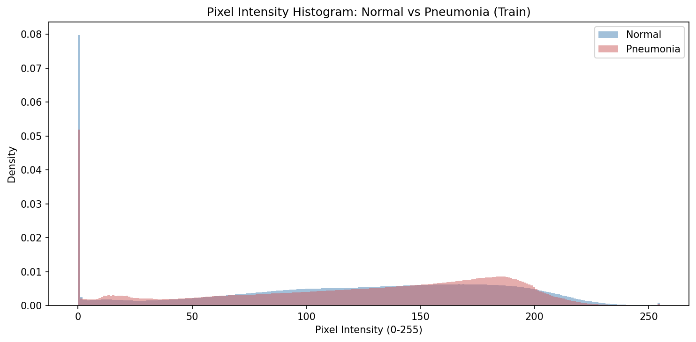
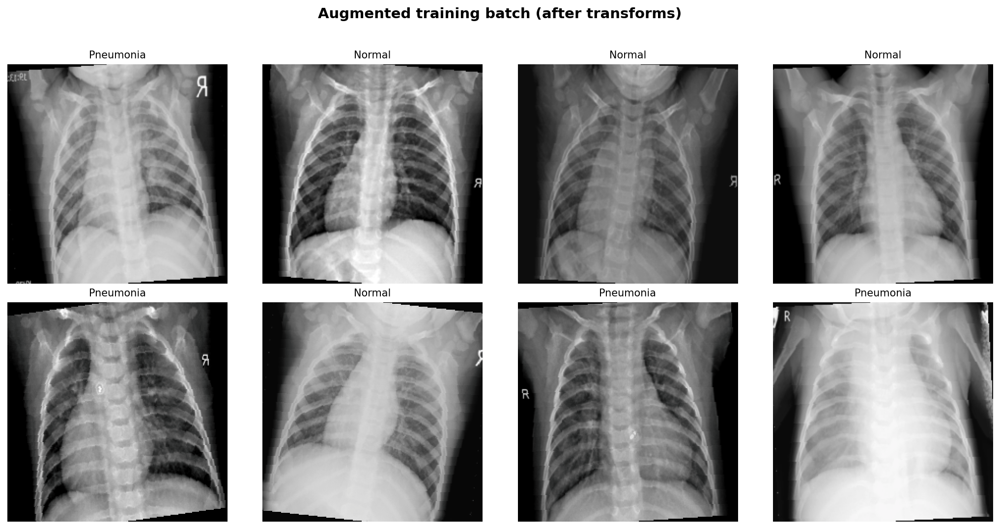
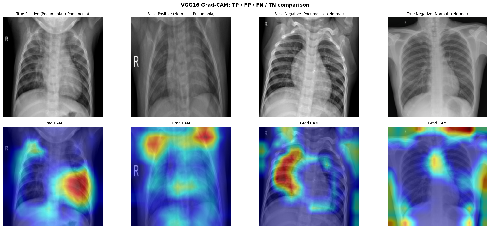
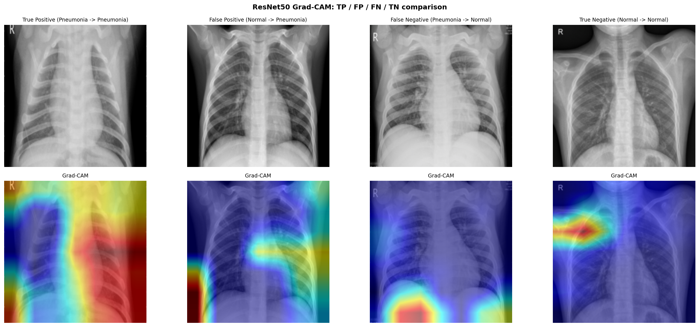
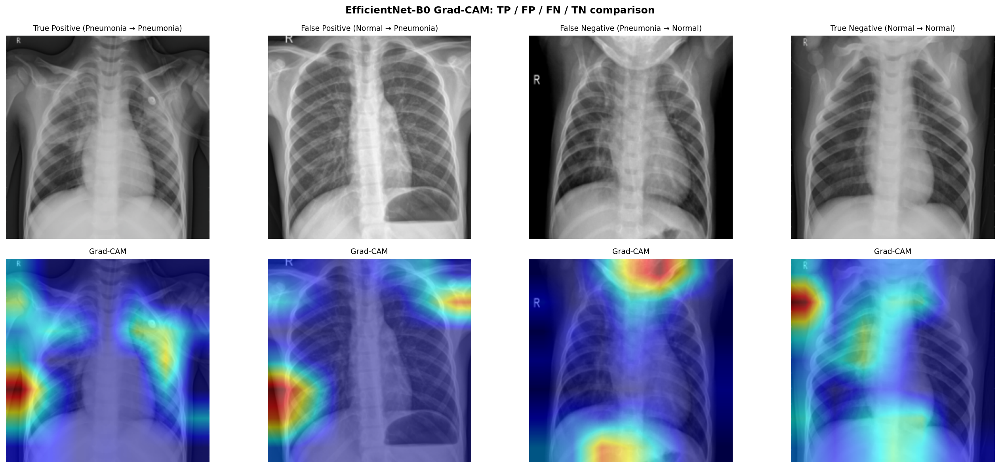
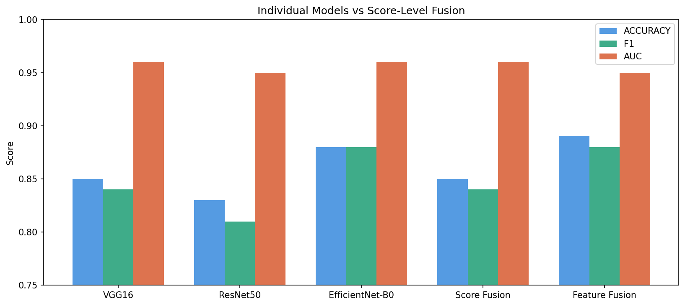

# Hybrid CNN Fusion for Pneumonia Detection

Multi-architecture deep learning pipeline for binary chest X-ray classification (Normal vs. Pneumonia), built on the [Chest X-Ray Images (Pneumonia)] (https://www.kaggle.com/datasets/paultimothymooney/chest-xray-pneumonia) dataset.
This README documents the data setup, EDA, baseline models and fusion model and their performances.
Motivation

## Motivation
Pneumonia is a leading cause of childhood mortality worldwide, and chest X-rays are one of the most common first-line diagnostic tools.
Manual reading is time-consuming and can vary between radiologists, especially under heavy clinical load.
Automated screening models can act as a decision-support tool: flagging likely pneumonia cases for urgent review while routing clearly normal scans faster.

Deep learning on medical images is challenging because labelled data is limited and class distributions are often imbalanced. This project addresses that by building a reproducible data pipeline, thorough EDA, and transfer learning from ImageNet-pretrained CNNs, with inverse-frequency class weighting and stratified splits.

## Objectives
This project develops a hybrid CNN ensemble for binary pneumonia detection (Normal vs Pneumonia) from chest X-rays, with a focus on clinical reliability rather than raw accuracy alone.
Specifically, we aim to:

- Train and evaluate three CNN baselines — VGG16, ResNet50, and EfficientNet-B0 — using transfer learning from ImageNet pretrained weights.

- Compare each model's performance with emphasis on Normal class recall, since misclassifying a healthy patient as Pneumonia has direct clinical consequences.

- Combine all three backbones through feature-level fusion to build an ensemble that leverages complementary representations.

- Apply Grad-CAM visualisation across all models to interpret where on the X-ray each model focuses, and assess whether attention aligns with clinically relevant lung regions.

## Project structure

```
hybrid-cnn-pneumonia/
├── configs/
│   └── config.yaml          # All hyperparameters + paths
├── data/
│   └── chest_xray/           # Kaggle dataset (not tracked)
├── model/
│   └── checkpoints/           # Saved .pth files (not tracked)
├── notebooks/
│   ├── 01_setup.ipynb     # Data pipeline 
│   ├── 02_EDA.ipynb       # EDA
│   ├── 03_Model_****.ipynb     # VGG16, ResNet50, EfficientNet
│   ├── 04_gradcam_***.ipynb       # Explainability analysis for VGG16, ResNet50, EfficientNet
│   ├── 05_fusion_***.ipynb        # fusion modls

├── outputs/
│   ├── figures/               # Training curves, comparison charts
│   ├── gradcam/               # Heatmap visualisations
│   └── metrics/               # JSON metric logs
├── src/
│   ├── __init__.py
│   ├── dataset.py             # Data loading + preprocessing
├── mlruns/                    # MLflow tracking (not tracked)
├── .gitignore
├── requirements.txt
└── README.md
```
## Dataset

| Item | Detail |
|---|---|
| Source | [Kaggle — Chest X-Ray Images (Pneumonia)](https://www.kaggle.com/datasets/paultimothymooney/chest-xray-pneumonia) (Kermany et al., 2018) |
| Total images | 5,856 (after cleaning nested folders) |
| Classes | Normal (0), Pneumonia (1) |
| Original splits | train 5,216 · val 16 · test 624 |
| Re-split strategy | Merged train + val → 80/10/10 stratified split; original test held out |

The original validation set (16 images) is too small for reliable evaluation, so training and validation data were re-split using stratified sampling to preserve class proportions.

| Split | Images | Normal | Pneumonia |
|---|---|---|---|
| Train | 4,650 | 1,199 | 3,451 |
| Val | 582 | 150 | 432 |
| Test | 624 | 234 | 390 |

> **Class imbalance:** Pneumonia : Normal ≈ 2.88 : 1 across the dataset. Class-weighted loss was applied during training to mitigate bias toward the majority class.
Project workflow


## Project flow

1. Download dataset— Kaggle API or manual download; verify image count and folder layout

2. Repository & preprocessing (merge-re-split-preprocessing) — merge train/val, 80/10/10 stratified split, torchvision transforms, class weights, DataLoaders

3. EDA — Class distribution, Sample visualisation, Width vs height scatter, Pixel intensity histogram. 

4. EDA — pipeline sanity check (6-eda--pipeline-sanity-check-24) — batch shape, pixel range, augmentation preview

5. Baseline models — VGG16, ResNet50, EfficientNet-B0 (transfer learning)

6. Fusion + Grad-CAM (in progress on team repo) — concatenate backbone features; explain predictions

### 1. Download dataset & repository setup

The [Chest X-Ray Images (Pneumonia)] (https://www.kaggle.com/datasets/paultimothymooney/chest-xray-pneumonia) dataset was downloaded (Kaggle API / zip from Drive) into data/chest_xray/ with train/, val/ and test/ subfolders per class.

The team repo ([MINI_PROJECT] (https://github.com/Skm48/MINI_PROJECT)) provides:

- src/ — shared dataset.py, utils.py, model helpers

- configs/config.yaml — paths, batch size, augmentation, training hyperparameters

- outputs/figures/ — EDA and training plots (committed to Git)

- .gitignore — excludes raw data/ and large. pth checkpoints


### 2. Merge + re-split & preprocessing

The original validation set contains only 16 images — too small for reliable validation. Train and val were merged (5,232 images) and re-split with sklearn.model_selection.train_test_split (stratify=labels, random_state=42) twice to obtain 80% train / 10% val; the original test set (624 images) was kept unchanged.

Preprocessing (torchvision.transforms)

Step Training Val / Test

Resize 224 * 224 224 * 224

Augmentation Horizontal flip, ±10° rotation, brightness/contrast jitter None

Normalisation ImageNet mean [0.485, 0.456, 0.406] , std [0.229, 0.224, 0.225] Same

Class weights w = 1 / class_freq → Normal 1.939, Pneumonia 0.674 Used in CrossEntropyLoss

Data Loaders: batch size 32, shuffle on train only. Split indices saved to data/split_indices.csv for reproducibility.

### 3.a EDA — Class distribution (2.1)





Bar charts show Normal vs. Pneumonia counts for train, val, and test. Pneumonia dominates every split, with an overall ratio of about 2.88: 1, matching the literature for this dataset. After the stratified re-split, the relative proportions stay similar across splits (train ~26% Normal, val/test slightly higher Normal share because test was fixed). This confirms stratification worked and justifies inverse-frequency class weights during training, so the model does not ignore the minority class.


### 3.b EDA — Sample visualisation (2.2)




A 4*4 grid of random samples contrasts Normal and Pneumonia cases side by side. Pneumonia images often show increased opacity / consolidation in one or both lung fields, while Normal scans appear clearer with visible rib and diaphragm outlines. No

obviously blank or corrupt files were seen in the sampled grid. Visual differences are subtle in some cases, which explains why high accuracy alone is insufficient — clinical review and explainability (Grad-CAM) matter.

### 3.c EDA — Width vs height scatter (2.3)




Raw image resolutions vary considerably across the dataset. Pneumonia images cluster at lower resolutions (400–1,200px), while Normal images span a wider 
range up to ~2,800px. This resolution gap likely reflects differences in acquisition source rather than clinical content. All images are resized to 
224×224 during preprocessing, so resolution does not directly influence model training — however it represents a potential dataset bias worth acknowledging.

### 3.c EDA — Pixel intensity histogram (2.4)



Raw image resolutions vary widely across the dataset, reflecting scans from different paediatric equipment. All images are resized to 224×224 prior to 
model input. X-rays are single-channel grayscale but are loaded as 3-channel RGB by replicating values across channels, consistent with ImageNet-pretrained 
backbone requirements.

Pixel intensity distributions (train set) show both classes share a dominant zero-intensity spike from background regions, with Normal cases showing 
proportionally more black background area. Pneumonia cases exhibit a heavier right tail (intensities 100–220), consistent with consolidation and infiltrates 
appearing as brighter opacities on the lung fields. The distributions overlap substantially but are distinguishable; intensity alone is insufficient for reliable classification. Pneumonia detection requires identifying *where* 
opacities appear on the lung field, not just *how bright* the image is overall. This spatial dependency makes CNNs the natural choice, as convolutional layers 
learn localised hierarchical features directly from image structure rather than relying on global statistics.

These observations motivated a fixed resize combined with ImageNet mean/std normalisation as the preprocessing standard across all three models.

### 4. EDA — Pipeline sanity check (2.5)





One training batch was loaded and inspected programmatically:


Check Result

Tensor shape [32, 3, 224, 224]

Labels {0, 1} — Normal / Pneumonia

Pixel range (after normalise) approx. [-2.12, 2.64]

Augmentation Flip / rotation / colour jitter visible on train only


The data loader, label mapping, and transforms are wired correctly before any model training. Augmentations increase diversity without changing val/test pipelines, which keeps evaluation fair.

### 5. Modelling

### VGG16 Architecture and Training Strategy

#### 1. Architecture Overview

VGG16 is a 16-layer convolutional neural network characterised by its uniform architecture: all convolutional layers employ 3×3 filters with stride 1 and same padding, with max pooling (2×2, stride 2) applied after each convolutional block to progressively reduce spatial dimensions. The network comprises approximately 138 million parameters.

##### 1.1 Feature Extraction Backbone

The convolutional backbone consists of five sequential blocks, each applying a series of convolution–ReLU operations followed by max pooling. The feature maps decrease in spatial resolution while increasing in channel depth at each stage:

| Block | Conv Layers | Filters | Input Size | Output Size | Role |
|-------|------------|---------|------------|-------------|------|
| Block 1 | 2 | 64 | 224 × 224 × 3 | 112 × 112 × 64 | Low-level edge and texture detection |
| Block 2 | 2 | 128 | 112 × 112 × 64 | 56 × 56 × 128 | Corner and contour features |
| Block 3 | 3 | 256 | 56 × 56 × 128 | 28 × 28 × 256 | Mid-level structural patterns |
| Block 4 | 3 | 512 | 28 × 28 × 256 | 14 × 14 × 512 | High-level shape representations |
| Block 5 | 3 | 512 | 14 × 14 × 512 | 7 × 7 × 512 | Abstract semantic features |

The final feature map of shape 7 × 7 × 512 (25,088 values when flattened) serves as the input to the classification head.

##### 1.2 Custom Classification Head

The original VGG16 classifier was designed for ImageNet's 1,000-class task. For binary pneumonia classification, it was replaced with a lightweight fully connected architecture:

| Layer | Input Dim | Output Dim | Activation | Description |
|-------|-----------|------------|------------|-------------|
| Flatten | 512 × 7 × 7 | 25,088 | — | Spatial features reshaped to 1D |
| Dense | 25,088 | 256 | ReLU | Dimensionality reduction |
| Dropout | 256 | 256 | — | 50% dropout for regularisation |
| Dense | 256 | 2 | — | Output scores for Normal / Pneumonia |

Classification is performed by selecting the class with the higher output score (argmax). Weighted cross-entropy loss was employed during training to account for class imbalance (Normal:Pneumonia ≈ 1:2.9), with inverse-frequency weighting applied.

#### 2. Transfer Learning Strategy

The model was initialised with weights pretrained on ImageNet (ILSVRC-2012), a large-scale natural image dataset containing 1.2 million images across 1,000 categories. 
Transfer learning was employed on the rationale that low- and mid-level features learned from natural images (edges, textures, shapes) generalise well to medical imaging tasks.

##### 2.1 Phase 1 — Frozen Backbone Training

In the first training phase, all convolutional blocks (Blocks 1–5) were frozen, preserving the pretrained ImageNet weights. Only the custom classification head was optimised.

| Parameter | Value |
|-----------|-------|
| Trainable parameters | ~6.4M (classifier head only) |
| Frozen parameters | ~128M (conv blocks 1–5) |
| Optimiser | Adam |
| Learning rate | 1 × 10⁻³ |
| Weight decay | 1 × 10⁻⁴ |
| Scheduler | ReduceLROnPlateau (patience=3, factor=0.5) |
| Epochs | 10 |
| Batch size | 32 |

Phase 1 achieved 98% validation accuracy by epoch 5, demonstrating strong transferability of ImageNet features to chest X-ray classification.

##### 2.2 Phase 2 — Fine-Tuning Block 5

In the second phase, Block 5 (the final convolutional block) was unfrozen to allow domain-specific adaptation of high-level feature representations. A substantially reduced learning rate was used to prevent catastrophic forgetting of the pretrained features.

| Parameter | Value |
|-----------|-------|
| Unfrozen layers | Block 5 (3 conv layers) |
| Learning rate | 1 × 10⁻⁶ |
| All other hyperparameters | As Phase 1 |

**Outcome:** Fine-tuning did not yield improvement over Phase 1. Test accuracy decreased marginally (from 84.6% to 85.9% accuracy), with Normal class recall declining from 0.68 to 0.65. The Phase 1 frozen model was therefore retained as the final VGG16 model.

This result suggests that ImageNet features transfer sufficiently well to the chest X-ray domain that fine-tuning the final convolutional block provides no additional benefit for this dataset. 
Similar findings have been reported in prior medical imaging transfer learning studies (Tajbakhsh et al., 2016).

### ResNet50

ResNet50's skip connections ease optimisation of deep networks, and its 2048-d global average pooling vector makes it well suited to transfer 
learning on 224×224 inputs.

#### Architecture

ResNet50 has ~25M parameters and uses Bottleneck blocks (1×1 → 3×3 → 1×1 convolutions) with residual shortcuts.

| Stage | Blocks | Role | Training |
|---|---|---|---|
| conv1 + maxpool | — | 224→56 spatial downsampling | Frozen |
| layer1 | 3 | Low-level edges / textures | Frozen |
| layer2 | 4 | Mid-level structures | Frozen |
| layer3 | 6 | High-level patterns | Frozen |
| layer4 | 3 | Deepest semantic features | Fine-tuned |
| avgpool | — | 2048-d global vector | — |
| Head | — | Dropout(0.4) → Linear(2048→2) | Trained |

**Forward path:**
Input (224×224×3) → conv1/maxpool → layer1–3 [frozen] → layer4 [fine-tuned]
→ avgpool (2048-d) → Dropout(0.4) → Linear → 2 logits

#### Training Setup

Weights initialised from ImageNet (`IMAGENET1K_V1`). Low- and mid-level 
filters transfer well to thoracic imaging; only layer4 and the classifier 
head were optimised.

| Parameter | Value |
|---|---|
| Loss | CrossEntropyLoss with inverse-frequency class weights |
| Optimiser | Adam — layer4 lr=1e-4, classifier lr=1e-3 |
| Scheduler | ReduceLROnPlateau (monitor: val accuracy, patience=2) |
| Early stopping | Patience=4 on val accuracy |
| Max epochs | 12 |
| Batch size | 32 |
| Best checkpoint | `model/checkpoints/resnet50_best.pth` |

### EfficientNet-B0

EfficientNet-B0 is a lightweight convolutional network built around 
compound scaling — balancing depth, width, and input resolution 
simultaneously rather than independently. Its core building blocks are 
Mobile Inverted Bottleneck Convolutions (MBConv) with Squeeze-and-Excitation 
(SE) attention, which recalibrate channel-wise feature responses adaptively.

#### Architecture

| Stage | Block | Output Channels | Repeats |
|---|---|---|---|
| 1 | MBConv1 | 16 | 1 |
| 2 | MBConv6 | 24 | 2 |
| 3 | MBConv6 | 40 | 2 |
| 4 | MBConv6 | 80 | 3 |
| 5 | MBConv6 | 112 | 3 |
| 6 | MBConv6 | 192 | 4 |
| 7 | MBConv6 | 320 | 1 |

The default classifier is replaced with a two-layer head adding capacity 
for domain-specific feature combination before the binary output.

**Forward path:**

Input (224×224×3) → features[0–7] [frozen in P1] → features[-3:] [fine-tuned in P2]
→ avgpool (1280-d) → Linear(1280→256) → ReLU → Dropout(0.5) → Linear(256→2) → 2 logits

### Training Setup

| Parameter | Phase 1 | Phase 2 |
|---|---|---|
| Trainable | Classifier head only | features[-3:] + head |
| Optimiser | Adam lr=1e-3, wd=1e-4 | Adam lr=1e-5, wd=1e-4 (single LR) |
| Scheduler | ReduceLROnPlateau (val loss, patience=3, factor=0.5) | Same |
| Early stopping | Patience=4 on val accuracy | Patience=4 on val accuracy |
| Loss | CrossEntropyLoss with inverse-frequency class weights | Same |
| Checkpoint | `best_model_frozen.pth` | `model/checkpoints/efficientnet_b0_best.pth` |

### Fusion Model Architecture and Training Strategy

#### 1. Fusion Approach Overview

This approach implements feature-level fusion, a multimodal ensemble technique that combines learned representations from multiple CNN architectures to produce a unified classification model.
Unlike score-level fusion (which averages or votes on final predictions), feature-level fusion concatenates the intermediate feature vectors extracted from each model's penultimate layer, preserving richer discriminative information prior to classification.
The rationale for fusion is that different CNN architectures learn complementary feature representations: VGG16 captures fine-grained textural patterns through its uniform 3×3 filter design, ResNet50 encodes hierarchical features via skip connections, and EfficientNet-B0 provides efficiently scaled representations through compound scaling.
Concatenating these diverse feature spaces enables the fusion classifier to exploit complementary strengths across architectures.

#### 2. Feature Extraction Pipeline

##### 2.1 Feature Sources

Features were extracted from the global average pooling (GAP) layer of each pretrained baseline model — the layer immediately preceding the classification head. All three backbone models were frozen during feature extraction (inference mode only).

| Model | Extraction Layer | Feature Dimension | Parameters |
|-------|-----------------|-------------------|------------|
| VGG16 | avgpool | 512 (after spatial averaging) | 138M |
| ResNet50 | avgpool | 2,048 | 25M |
| EfficientNet-B0 | avgpool | 1,280 | 5M |
| **Concatenated** | — | **3,840** | — |

For VGG16, the raw avgpool output is of shape 512 × 7 × 7. Spatial average pooling was applied to reduce this to a 512-dimensional vector, consistent with the dimensionality reduction applied by ResNet50 and EfficientNet-B0 internally. 
Initial experiments using the flattened 25,088-dimensional VGG16 features resulted in overfitting; the pooled 512-dimensional representation yielded superior fusion performance.

##### 2.2 Feature Normalisation

Each model's feature vectors occupy different numerical ranges due to differences in architecture and activation distributions. To prevent any single model's features from dominating the fused representation, per-model standardisation was applied using `sklearn.preprocessing.StandardScaler`:

- Scalers were fit on the training set features only
- The same fitted scalers were applied to validation and test sets (no data leakage)
- Post-normalisation, all feature dimensions have zero mean and unit variance

##### 2.3 Extraction Process

Features were extracted for all three dataset splits using forward hooks registered on each model's avgpool layer.
The extraction pipeline processes each image through all three frozen backbones in a single pass, storing the resulting feature vectors for subsequent fusion classifier training.

#### 3. Fusion Classifier Architecture

The fusion classifier is a fully connected neural network trained on the concatenated feature vectors. The architecture was designed to be lightweight relative to the backbone models, as the input features are already highly discriminative.

| Layer | Input Dim | Output Dim | Activation | Description |
|-------|-----------|------------|------------|-------------|
| Dense | 3,840 | 512 | ReLU | Feature compression |
| Dropout | 512 | 512 | — | 50% dropout for regularisation |
| Dense | 512 | 128 | ReLU | Further compression |
| Dropout | 128 | 128 | — | 30% dropout |
| Dense | 128 | 2 | — | Output scores for Normal / Pneumonia |

Total trainable parameters: approximately 2.0M (fusion head only; backbone weights are frozen).

#### 4. Training Configuration

The fusion classifier was trained on pre-extracted features, making training computationally inexpensive (no image processing required during optimisation).

| Parameter | Value |
|-----------|-------|
| Optimiser | Adam |
| Learning rate | 1 × 10⁻³ |
| Weight decay | 1 × 10⁻⁴ |
| Scheduler | ReduceLROnPlateau (patience=3, factor=0.5) |
| Loss function | Weighted CrossEntropyLoss (inverse-frequency) |
| Epochs | 20 |
| Batch size | 32 |

Training converged within approximately 15 epochs. The best model was selected based on minimum validation loss.

## Explainable AI (Grad-CAM)

Pneumonia causes inflammation in one or both lungs, and understanding how a 
model makes decisions is as important as what it predicts. Grad-CAM was 
applied to VGG16, ResNet50, and EfficientNet-B0 to visualise the regions of 
each chest X-ray that contributed most strongly to the model's output.

Heatmaps were analysed across four prediction outcomes:

| Case | Description |
|---|---|
| True Positive (TP) | Pneumonia correctly identified |
| False Positive (FP) | Normal misclassified as Pneumonia |
| False Negative (FN) | Pneumonia missed |
| True Negative (TN) | Normal correctly identified |







### Model-by-Model Comparison

| Aspect | VGG16 | ResNet50 | EfficientNet-B0 |
|---|---|---|---|
| Attention quality | Shallow, inconsistent; edge-focused | Structured; better localisation | Most stable and context-aware |
| True positives | Good on obvious cases | Broad diffuse activation; correct region but lacks focused localisation | Best alignment with pathology |
| False positives | High; distracted by ribs/markers | Moderate | Lowest FP tendency |
| False negatives | High; misses subtle cases | Moderate | Lowest FN rate |
| Artefact sensitivity | Very high | Moderate | Low |
| Interpretability | Clear but simplistic | Strong and stable | Most clinically meaningful |
| Overall reliability | Lowest | Good | Highest |

Grad-CAM results varied across images for all models, confirming that 
attention maps are image-dependent. When TP/FP/FN/TN examples were swapped, 
the highlighted regions shifted accordingly. This is expected because 
pneumonia can appear in different lung regions, and each architecture extracts 
features differently. EfficientNet-B0 remained the most consistent across 
multiple images.


## Results and Comparision



The three baseline CNNs showed distinct behaviours:

· VGG16: Sensitive to strong pneumonia patterns but highly affected by artefacts and inconsistent attention.

· ResNet50: Better localisation and higher precision but occasionally missed subtle pneumonia.

· EfficientNet-B0: Strongest standalone model with the highest recall, F1-score, and accuracy. Its Grad-CAM maps were the most clinically aligned and stable.

High recall is especially important in pneumonia detection because missing a positive case poses significant clinical risk.
Efficient Net-B0’s strong recall and robust attention patterns make it the most reliable individual model.

Two fusion strategies were evaluated against the individual backbones: feature-level fusion (concatenating intermediate feature representations into a single classifier) and score-level fusion (averaging the models' output probabilities).

Feature fusion achieved the highest accuracy of all approaches at 0.89, a marginal improvement over the strongest individual model, EfficientNet-B0 (0.88). Its F1-score (0.88) matched EfficientNet-B0 rather than exceeding it.
Notably, this accuracy gain did not extend to ranking quality: feature fusion recorded the lowest AUC of all five models (0.95), slightly below every individual backbone. This suggests that combining and re-learning from the concatenated features sharpened the decision boundary at the default threshold, but did not improve the model's underlying ability to separate cases — likely because the three backbones make largely correlated errors on the genuinely ambiguous X-rays.

Score fusion preserved strong ranking performance, tying for the highest AUC (0.97), but did not improve thresholded accuracy (0.86) or F1 (0.85) over the best individual model. The fixed equal-weight averaging appears to have been suboptimal at the 0.5 decision threshold.

Overall, fusion produced a small, metric-dependent improvement rather than a decisive gain across all metrics. The limited benefit is consistent with the individual models already performing strongly (AUC 0.95–0.97) and making overlapping mistakes, leaving little complementary signal for fusion to exploit. 
EfficientNet-B0 remains the most balanced single model, and feature fusion offers a modest accuracy advantage where maximising correct classifications at a fixed threshold is the priority.


| Model | Accuracy | F1 | AUC-ROC |
|-------|----------|----|---------|
| VGG16 |   0.85 |   0.84 |   0.96 |
| ResNet50 |   0.87 |   0.86 |   0.97 |
| EfficientNet-B0 |   0.88 |   0.88 |   0.96 |
| **Fusion** |   0.89 |  0.88 |   0.95 |

## Conclusion
EfficientNet-B0 emerged as the strongest individual model, offering the best balance of accuracy, recall, and clinically meaningful Grad-CAM attention. 
Feature-level fusion achieved the highest accuracy overall (0.89), a marginal gain over EfficientNet-B0 (0.88), with a comparable F1-score.
This improvement did not extend to AUC, where feature fusion scored slightly lower than every individual model — indicating that fusion sharpened classification at the chosen threshold rather than improving the underlying separation of cases. 
The modest gains are consistent with three already-strong backbones that make largely overlapping errors, leaving limited complementary signal to exploit.
The trade-off is computational cost: fusion requires running all three models and training an additional classifier, making EfficientNet-B0 the more practical choice when resources or time are limited. Feature fusion offers a small accuracy advantage where maximising correct classifications at a fixed threshold is the priority, but it does not provide a decisive improvement across all metrics.

## Limitations

· Computational cost: Fusion requires extracting features from three CNNs, increasing training and inference time.

· Dataset bias: Pneumonia dominates the dataset (≈2.9:1), and images come from mixed acquisition sources.

· Generalisation: Models were trained on a single dataset; external validation is needed.

· Explainability variability: Grad-CAM attention shifts depending on the specific X-ray.

## Future Work

· Evaluate on external datasets (NIH, CheXpert, RSNA).

· Explore lighter fusion strategies (e.g., weighted score-level ensembling).

· Investigate attention-based architectures (Vision Transformers, ConvNeXt).

· Apply lung segmentation to reduce artefact sensitivity.

· Develop a clinical decision-support prototype with uncertainty estimation.

## Tech stack

- **Framework:** PyTorch + torchvision
- **Models:** VGG16, ResNet50, EfficientNet-B0 (ImageNet pretrained)
- **Explainability:** pytorch-grad-cam
- **Tracking:** MLflow
- **Evaluation:** scikit-learn


## References

1. Kermany et al. (2018) — Cell, 172(5), 1122–1131
2. Simonyan & Zisserman (2015) — VGG, ICLR 2015
3. He et al. (2016) — ResNet, CVPR 2016
4. Tan & Le (2019) — EfficientNet, ICML 2019
5. Selvaraju et al. (2017) — Grad-CAM, ICCV 2017

## License

MIT
